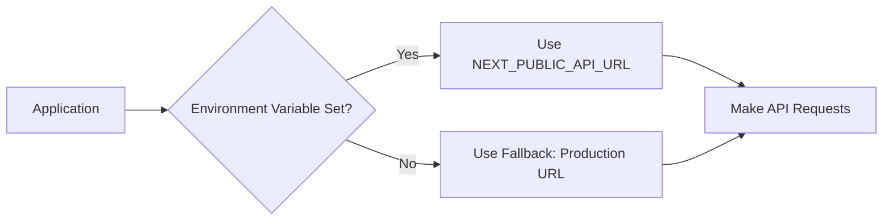

# Environment Configuration Guide

## 🌐 API Endpoint Configuration

This application supports **dual environment setup**, allowing you to seamlessly switch between:
- **Production API** (Deployed on Vercel)
- **Local Development API** (Running on localhost)

---

## 🚀 Quick Start

### Step 1: Copy Environment File
```bash
# Copy the example file to create your local configuration
cp .env.example .env.local
```

### Step 2: Choose Your Environment

#### Option A: Use Production API (Default)
Open `.env.local` and ensure:
```env
NEXT_PUBLIC_API_URL=https://mobulous-tech.vercel.app/api
```

#### Option B: Use Local Development API
Open `.env.local` and change to:
```env
NEXT_PUBLIC_API_URL=http://localhost:3001/api
```
*(Adjust port number if your local API uses a different port)*

### Step 3: Restart Development Server
```bash
# Stop the current server (Ctrl+C)
# Start it again
npm run dev
```

---

## 📋 Configuration Details

### Environment Variables

#### `NEXT_PUBLIC_API_URL`
- **Type**: String
- **Required**: No (has fallback)
- **Default**: `https://mobulous-tech.vercel.app/api`
- **Format**: Full URL without trailing slash
- **Prefix**: `NEXT_PUBLIC_` (required for client-side access in Next.js)

### Examples:

| Environment | URL |
|-------------|-----|
| Production | `https://mobulous-tech.vercel.app/api` |
| Local Dev (Port 3001) | `http://localhost:3001/api` |
| Local Dev (Port 8000) | `http://localhost:8000/api` |
| Staging | `https://staging-api.example.com/api` |

---

## 🔧 How It Works

### Architecture



### Code Implementation

The configuration is centralized in `services/api/config.ts`:

```typescript
const getApiBaseUrl = (): string => {
  const envUrl = process.env.NEXT_PUBLIC_API_URL;
  
  if (envUrl) {
    console.log('🌐 Using API URL from environment:', envUrl);
    return envUrl;
  }
  
  // Fallback to production
  const fallbackUrl = 'https://mobulous-tech.vercel.app/api';
  console.warn('⚠️ NEXT_PUBLIC_API_URL not set, using fallback:', fallbackUrl);
  return fallbackUrl;
};

export const API_CONFIG = {
  BASE_URL: getApiBaseUrl(),
  // ... rest of config
};
```

### Console Logs

When the app starts, you'll see one of these messages in the browser console:

- ✅ **Environment variable found**:
  ```
  🌐 Using API URL from environment: https://mobulous-tech.vercel.app/api
  ```

- ⚠️ **Using fallback**:
  ```
  ⚠️ NEXT_PUBLIC_API_URL not set, using fallback: https://mobulous-tech.vercel.app/api
  ```

---

## 🔄 Switching Between Environments

### Method 1: Edit .env.local (Recommended)

**For Production:**
```env
# .env.local
NEXT_PUBLIC_API_URL=https://mobulous-tech.vercel.app/api
```

**For Local Development:**
```env
# .env.local
NEXT_PUBLIC_API_URL=http://localhost:3001/api
```

Then restart the dev server.

### Method 2: Use Multiple .env Files

Create environment-specific files:

**`.env.local`** (for local development):
```env
NEXT_PUBLIC_API_URL=http://localhost:3001/api
```

**`.env.production`** (for production build):
```env
NEXT_PUBLIC_API_URL=https://mobulous-tech.vercel.app/api
```

Next.js will automatically use the appropriate file based on the environment.

---

## ✅ Verification

### Check Current Configuration

1. **Start the development server**:
   ```bash
   npm run dev
   ```

2. **Open the browser** and navigate to the app

3. **Open DevTools Console** (F12 or Ctrl+Shift+I)

4. **Look for the log message**:
   - You should see: `🌐 Using API URL from environment: [YOUR_URL]`

5. **Test API calls**:
   - Go to `/dashboard/users`
   - Check the Network tab for API requests
   - Verify requests are going to the correct URL

### Test Both Environments

#### Testing Production API:
```bash
# 1. Set .env.local to production URL
# 2. Restart server
npm run dev

# 3. Open http://localhost:3000/dashboard/users
# 4. Check console: Should show production URL
# 5. Check Network tab: Should show requests to vercel.app
```

#### Testing Local API:
```bash
# 1. Start your local API server on port 3001
# 2. Set .env.local to http://localhost:3001/api
# 3. Restart dev server
npm run dev

# 4. Open http://localhost:3000/dashboard/users
# 5. Check console: Should show localhost URL
# 6. Check Network tab: Should show requests to localhost:3001
```

---

## 🐛 Troubleshooting

### Environment Variable Not Loading

**Problem**: The app still uses the old URL after changing `.env.local`

**Solutions**:
1. **Restart the dev server** (environment variables are loaded at startup)
   ```bash
   # Stop with Ctrl+C, then:
   npm run dev
   ```

2. **Clear Next.js cache**:
   ```bash
   rm -rf .next
   npm run dev
   ```

3. **Check file name**: Must be `.env.local` (not `.env` or `.env.dev`)

4. **Check variable name**: Must start with `NEXT_PUBLIC_` for client-side access

### CORS Errors with Localhost

**Problem**: API requests blocked by CORS when using localhost

**Solutions**:
1. **Configure CORS on your local API**:
   ```javascript
   // Example for Express.js
   const cors = require('cors');
   app.use(cors({
     origin: 'http://localhost:3000'
   }));
   ```

2. **Use a proxy** in Next.js (if needed)

### Wrong Port Number

**Problem**: Using wrong port for local API

**Solutions**:
1. Check which port your local API is running on
2. Update `.env.local` with the correct port:
   ```env
   NEXT_PUBLIC_API_URL=http://localhost:YOUR_PORT/api
   ```

### Variable Not Working in Production

**Problem**: Environment variable works locally but not in production

**Solutions**:
1. **Vercel/Netlify**: Add environment variables in the dashboard
   - Go to Project Settings → Environment Variables
   - Add `NEXT_PUBLIC_API_URL` with your production URL

2. **Rebuild and redeploy** after adding variables

---

## 📁 File Structure

```
project-root/
├── .env.example          # Template with examples
├── .env.local           # Your local configuration (gitignored)
├── .env.production      # Production settings (optional)
├── .gitignore           # Ensures .env.local is not committed
└── services/
    └── api/
        └── config.ts    # Reads environment variables
```

---

## 🔐 Security Best Practices

### ✅ DO:
- ✅ Use `.env.local` for sensitive configuration
- ✅ Add `.env*` to `.gitignore`
- ✅ Use different URLs for development and production
- ✅ Document environment variables in `.env.example`
- ✅ Use HTTPS for production APIs

### ❌ DON'T:
- ❌ Commit `.env.local` to git
- ❌ Store API keys or secrets in environment variables exposed to the client
- ❌ Use production API for local development testing
- ❌ Hardcode API URLs directly in code

---

## 📚 Additional Resources

### Next.js Documentation:
- [Environment Variables](https://nextjs.org/docs/basic-features/environment-variables)
- [Client-side Environment Variables](https://nextjs.org/docs/basic-features/environment-variables#exposing-environment-variables-to-the-browser)

### API Configuration:
- Production API: `https://mobulous-tech.vercel.app/api`
- API Documentation: See `API_INTEGRATION_GUIDE.md`

---

## 💡 Tips

### For Development:
- Keep `.env.local` pointing to localhost while developing
- Use production URL only when testing production-like behavior
- Check console logs to verify which API is being used

### For Testing:
- Test both environments before deploying
- Verify API responses are consistent
- Check for CORS and network issues

### For Production:
- Always use HTTPS for production API
- Set environment variables in your hosting platform
- Use the fallback mechanism as a safety net

---

**Last Updated**: Environment configuration with dual support  
**Status**: ✅ Ready for both localhost and production use
